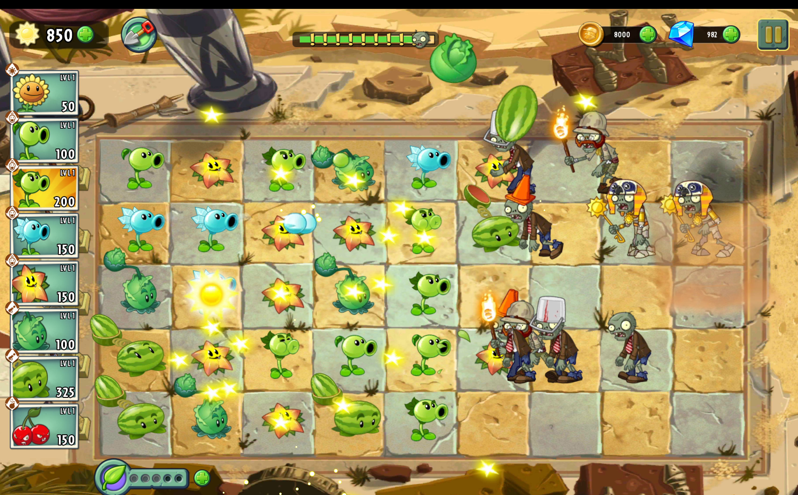

# Plants vs. Zombies 2 - Java Recreation

A desktop recreation of the popular strategy tower defense game *Plants vs. Zombies 2*. This project is a collaborative effort developed in **Java**, focusing on a robust, decoupled backend architecture, modular game mechanics, and scalable data management.

---

## 🎥 Gameplay Demo

*Click on the photo to watch the video.*

## 🛠️ Project Status: Work in Progress (WIP)
This repository represents a **3-member team project**. The core game logic, state machines, and data persistence layers are nearing completion. The upcoming development phases will focus heavily on integrating advanced graphical assets and implementing networking capabilities.

---

## 🚀 Tech Stack & Core Tools
* **Language:** Java
* **Framework/Libraries:** LibGDX, Gson (JSON Parsing)
* **Build Tool:** Gradle
* **Architecture:** Object-Oriented Design (utilizing structural and behavioral design patterns)

---

## 📦 Current Features & Progress

### 🧠 Core Game Logic - *Near Completion*
* **Grid & Placement System:** Fully functional tile-based grid mechanics managing plant deployment, resource collection, and lane validation.
* **Entity Behavior & State Machine:** Implemented modular logic for diverse plant behaviors (offensive, defensive, resource-generating) and varying zombie archetypes.
* **Data Persistence:** Integrated a custom data manager leveraging the Gson library to seamlessly handle JSON-based saving and loading of user profiles, seasons, and unlocked tiers.
* **Game Loop & Wave Controller:** Implemented robust backend mechanics for progression tracking, wave spawning timelines, and dynamic lane-based combat resolution.

### 🎨 Graphics & UI - *In Progress*
* Currently utilizing temporary layout placeholders while integrating the final high-fidelity graphical assets.
* Next Steps: Setting up full texture atlases, sprite animations, and smooth UI transitions.

### 🌐 Networking & Multiplayer - *Planned*
* The core architecture has been strictly decoupled from the rendering layer to smoothly support upcoming networking features.
* Next Steps: Implementing socket-based communication and state synchronization for multiplayer features.

---

## 👥 Team & Collaboration
This project is actively developed by a dedicated team of 3 computer engineering students. The tasks are distributed across:
* Core Backend Logic & Structural Architecture
* Data Management, JSON Serialization & State Controllers
* Graphics Pipeline, UI Elements & Network Infrastructure

---

## 🛠️ Architecture Overview
The codebase emphasizes a strict separation of concerns. By keeping the game logic entirely independent of the visual representation, the team ensures that adding the upcoming graphics and network syncing layers will not break the established game core.

---

| Student Name         |
|----------------------|
| Haniyeh Akbari       |
| Yasin Teimouri Kia   |
| Zahra Golafshani     |

